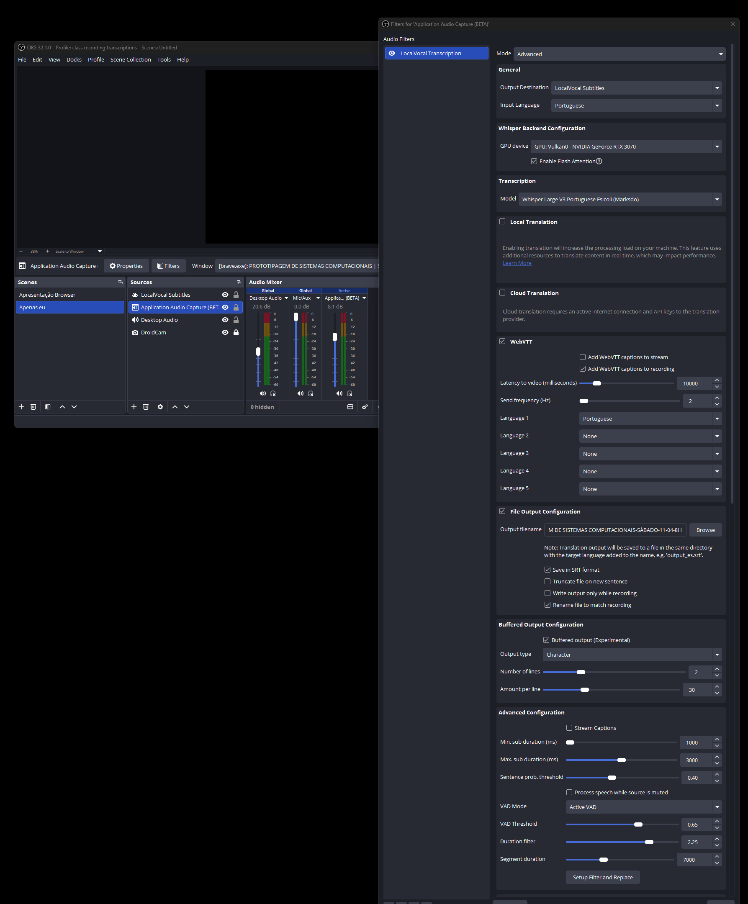
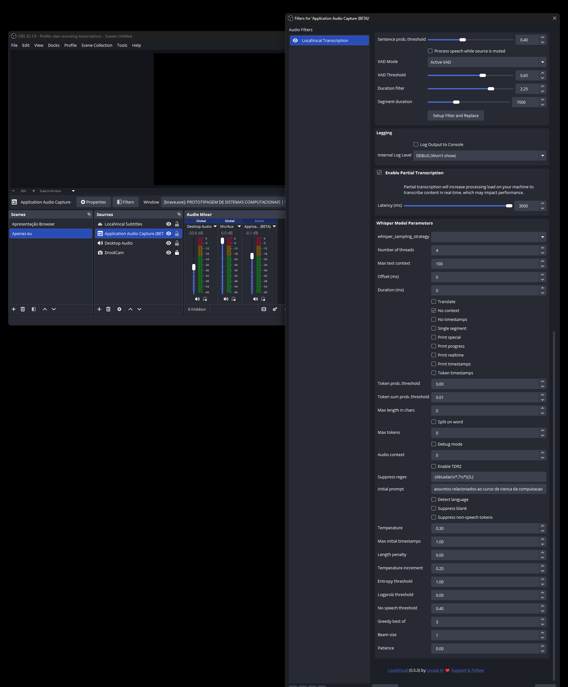

# OBS LocalVocal — Classroom Transcription Setup

## Overview

Real-time Portuguese transcription of university lectures using OBS Studio + LocalVocal plugin (Whisper-based). Saves `.srt` / `.vtt` files per class session for post-processing into study notes.

**Model in use:** Whisper Large V3 Portuguese Fsicoli (Marksdo variant, ~2.9 GB VRAM)
**GPU backend:** CUDA (flash attention enabled)
**Language:** Portuguese (`pt`)

---

## Prerequisites

- Pop!_OS 24.04 with NVIDIA drivers installed (see [HARDWARE.md](../HARDWARE.md))
- CUDA toolkit available (`nvidia-smi` working)
- OBS Studio installed via apt (see below)
- ~3 GB free disk space for model
- `pavucontrol` installed for audio routing

---

## 1. Install OBS Studio

```bash
sudo apt install obs-studio
```

> Use the **apt version** — Flatpak sandboxing prevents CUDA library access.

---

## 2. Install Dependencies

```bash
sudo apt install pavucontrol libopenblas0 libopenblas0-pthread
```

If you get unmet dependency errors, run:
```bash
sudo apt --fix-broken install
```

---

## 3. Install obs-localvocal Plugin

Download the **NVIDIA `.deb`** (not generic) from the GitHub releases page.
Latest tested: v0.6.1

```bash
# Download NVIDIA build
wget "https://github.com/royshil/obs-localvocal/releases/download/0.6.1/obs-localvocal-0.6.1-x86_64-linux-gnu-nvidia.deb" \
     -O ~/Downloads/obs-localvocal-nvidia.deb
```

### Driver version mismatch workaround (driver 580 + dep requires 570)

Pop!_OS ships `libnvidia-compute-580` but the `.deb` hardcodes a dep on `libnvidia-compute-570`. Force-install — they are binary-compatible:

```bash
sudo dpkg -i --ignore-depends=libnvidia-compute-570 ~/Downloads/obs-localvocal-nvidia.deb
```

If it fails with missing `libopenblas0`:
```bash
sudo apt --fix-broken install
# then re-run the dpkg command above
```

Verify install:
```bash
dpkg -l obs-localvocal          # should show "ii"
ls /usr/lib/x86_64-linux-gnu/obs-plugins/ | grep localvocal
ldd /usr/lib/x86_64-linux-gnu/obs-plugins/obs-localvocal.so | grep cuda
```

Restart OBS — **Tools → obs-localvocal** should appear.

---

## 4. Virtual Audio Sink (PipeWire)

A persistent virtual sink (`lecture_capture`) is created on login via systemd.
This is the equivalent of Windows' Application Audio Capture (WASAPI).

The service file is at `configs/systemd/pipewire-lecture-sink.service` and is deployed by `install.sh`.

Verify the sink exists:
```bash
pactl list sinks short | grep lecture_capture
```

---

## 5. Lecture Capture Script

`lecture-capture.sh` (deployed to `~/.local/bin/`) manages audio routing during class:

- Sets a `lecture-mode` flag so the HDMI watchdog skips stream routing
- Keeps Brave's audio routed to `lecture_capture` every 5 seconds
- Cleans up on Ctrl+C, restoring normal HDMI routing

**Before class:**
```bash
lecture-capture.sh
```

**After class:** press `Ctrl+C` — Brave returns to HDMI automatically.

### Why the flag is needed

`hdmi-audio-watchdog.sh` runs every 30 seconds and moves all audio streams back to HDMI (TV power-cycle recovery). Without the lecture-mode flag, it would pull Brave back from `lecture_capture` every 30 seconds. The flag makes the watchdog skip stream routing entirely during class, without changing any default audio device behavior.

---

## 6. Audio Routing per Session

1. Start playing audio in Brave (Teams/class video)
2. Run `lecture-capture.sh` in a terminal
3. Open `pavucontrol` → **Playback** tab
4. Find the Brave entry → set output to **Lecture Capture**
   (the script will keep it there automatically)
5. In OBS, the `Lecture Audio` source should show audio activity

---

## 7. OBS Setup

### Profile
**Profile → New → `class_recording_transcriptions`**

### Audio source
Sources `+` → **Audio Output Capture** → name: `Lecture Audio` → device: `lecture_capture.monitor`

### LocalVocal filter
Right-click `Lecture Audio` → Filters → `+` → **LocalVocal Transcription**

#### Basic settings

| Setting | Value |
|---------|-------|
| Model | Whisper Large V3 Portuguese Fsicoli (Marksdo) → Download (~2.9 GB) |
| Language | `pt` |
| Buffered output | ✅ enabled |
| Partial latency | `3000` ms |
| Buffer lines | `2` |
| Characters per line | `30` |
| Subtitle source | `LocalVocal Subtitles` |

#### Advanced settings

| Setting | Value |
|---------|-------|
| Flash attention | ✅ enabled |
| No context | ✅ enabled |
| Temperature | `0.05` |
| Entropy threshold | `1.0` |
| Logprob threshold | `0.0` |
| No-speech threshold | `0.4` |
| Greedy best_of | `3` |
| Beam search size | `1` |
| Backend device | `0` (GPU 0) |
| Suppress regex | `(décadas\s*,?\s*){3,}` |
| Initial prompt | `Aula sobre assuntos relacionados ao curso de ciencia da computacao` |

> **suppress regex** prevents Whisper from looping "décadas" during silence.
> Adjust **initial prompt** per subject for better accuracy.

#### Initial prompt by subject
```
Engenharia de Prompt:  "Aula sobre engenharia de prompt e aplicações em inteligência artificial."
Prototipagem:          "Aula sobre prototipagem de sistemas computacionais."
Generic CS:            "Aula sobre assuntos relacionados ao curso de ciencia da computacao."
```

#### Output settings

| Setting | Value |
|---------|-------|
| Save SRT subtitles | ✅ enabled |
| WebVTT captions | ✅ enabled, language `pt` |
| Caption to recording | ✅ enabled |
| Output file path | `/path/to/cs-cruzeiro-do-sul/01-semestre/<disciplina>/aulas/<NOME-DATA>` |

Output path naming convention: `DISCIPLINA-DIA-DD-MM-HH`
Example: `PROTOTIPAGEM-SABADO-11-04-8H`

OBS writes `<path>.srt` and `<path>.vtt` during recording.

### Subtitle text source
Sources `+` → **Text (FreeType 2)** → name: `LocalVocal Subtitles`

| Setting | Value |
|---------|-------|
| Font | Liberation Sans (or Arial), 72pt, Regular |
| Outline | ✅ enabled, 7px, black |
| Word wrap | ✅ enabled |
| Bounds type | Fixed size |
| Bounds width | `1500` |
| Bounds height | `230` |

---

## 8. Verify GPU Acceleration

```bash
# While OBS is transcribing:
nvidia-smi
# Should show obs process using ~3 GB VRAM

# Check CUDA linkage:
ldd /usr/lib/x86_64-linux-gnu/obs-plugins/obs-localvocal.so | grep -E "cuda|cublas"
```

---

## Troubleshooting

### Plugin doesn't appear in OBS filters
```bash
# Check OBS loaded it
cat ~/.config/obs-studio/logs/$(ls -t ~/.config/obs-studio/logs/ | head -1) | grep -i localvocal

# Check all deps resolved
ldd /usr/lib/x86_64-linux-gnu/obs-plugins/obs-localvocal.so | grep "not found"
```

### Brave audio keeps switching back to HDMI
The HDMI watchdog runs every 30 seconds. Make sure `lecture-capture.sh` is running — it sets the lecture-mode flag that pauses the watchdog's stream routing.

```bash
cat ~/.local/state/lecture-mode    # should print "on" during class
```

### Virtual sink missing after reboot
```bash
systemctl --user status pipewire-lecture-sink.service
systemctl --user restart pipewire-lecture-sink.service
```

### No transcription output
```bash
pactl list sources short | grep lecture_capture   # monitor source should exist
```

### Model fails to load / OOM
Large V3 requires ~3 GB VRAM:
```bash
nvidia-smi --query-gpu=memory.free --format=csv
```
Close other GPU-intensive apps, or fall back to `ggml-large-v3.bin`.

### Hallucination loops ("décadas décadas...")
Suppress regex `(décadas\s*,?\s*){3,}` handles this. Add other repeated words:
```
(décadas|palavra\s*){3,}
```

---

## Key Files

| File | Location |
|------|----------|
| Plugin binary | `/usr/lib/x86_64-linux-gnu/obs-plugins/obs-localvocal.so` |
| Plugin data | `/usr/lib/x86_64-linux-gnu/obs-plugins/obs-localvocal/` |
| Models | `~/.config/obs-studio/plugin_config/obs-localvocal/models/` |
| Active model | `models/ggml-large-v3-fsicoli.pt/ggml-large-v3-fsicoli.pt.bin` (~2.9 GB) |
| Lecture capture script | `~/.local/bin/lecture-capture.sh` |
| Virtual sink service | `~/.config/systemd/user/pipewire-lecture-sink.service` |
| Lecture mode flag | `~/.local/state/lecture-mode` |
| OBS logs | `~/.config/obs-studio/logs/` |
| Scene collection | `~/.config/obs-studio/basic/scenes/` |
| Profile | `~/.config/obs-studio/basic/profiles/class_recording_transcriptions/` |

---

## Windows Config Reference

Original working setup from Windows — used as reference for this Linux port.
All settings from these screenshots are reproduced in the tables above.

**Basic / Output tab:**


**Advanced tab:**

